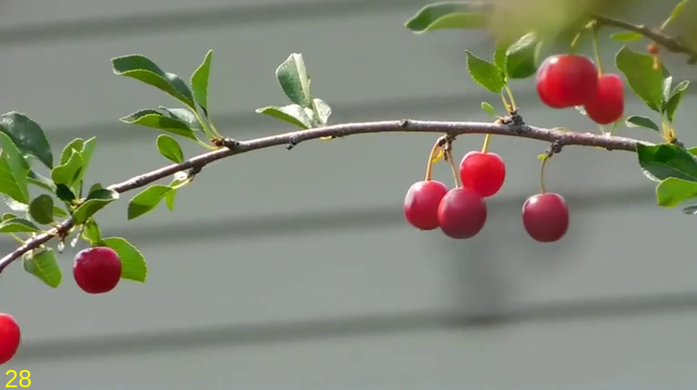
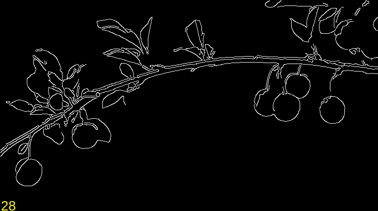
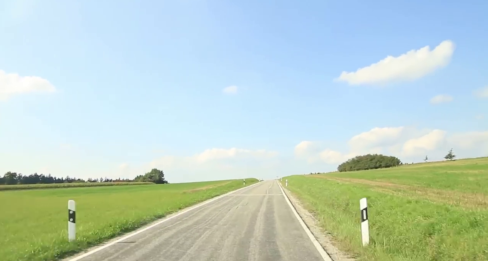
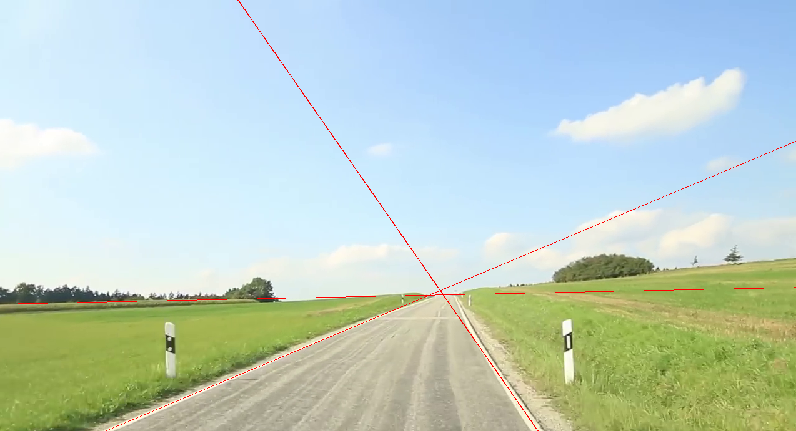

# GPU Filters

Four image processing filters implemented in pure C and in OpenCL to compare their performances.

**Edge Detection** with Canny's algorithm

Raw                        |  Processed
:-------------------------:|:-------------------------:
  |  

**Line Detection** with Hough's transform

Raw                        |  Processed
:-------------------------:|:-------------------------:
  |  

**Dense Optical Flow** with Lucas-Kanade

Raw                        |  Processed
:-------------------------:|:-------------------------:
  |  

**Region Filling** via exemplar-based image inpainting

Raw                        |  Processed
:-------------------------:|:-------------------------:
  |  

# Dependencies
* ### OpenCL 1.2 with C++ bindings


Filters are implemented using OpenCL 1.2. To download needed headers and libraries (linux) for compilation run:


```shell
sudo apt install ocl-icd-libopencl1
sudo apt install opencl-headers
sudo apt install clinfo
```

We've also used the C++ bindings, which are included in the repo.

A device that supports OpenCL is needed to run the program. Drivers installation varies. These are some devices in which the program ran and how to install their drivers:

**NVIDIA GeForce 940m**

```shell
sudo add-apt-repository ppa:graphics-drivers/ppa
sudo apt-get update
sudo apt-get install nvidia-355 nvidia-prime
sudo reboot
```


* ### OpenCV 2


For camera input only. **Central algorithms are not implemented using this library.**

To get eveything needed to compile run:

```shell
sudo apt-get install libopencv-dev
```


* ### Qt 4.8
For an advanced GUI only, not actually needed to run the bascis. More information at `gui/readme.md`
